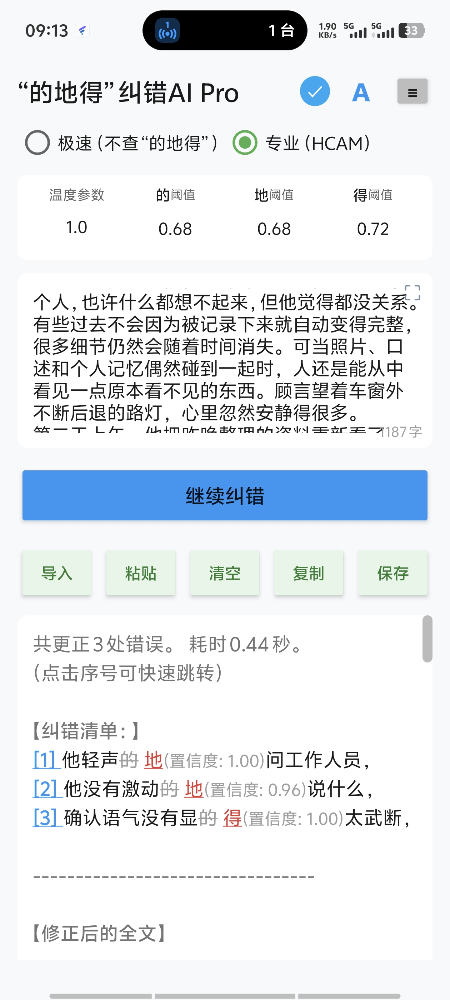

# HCAM 100M 中文掩码语言模型 / Chinese Masked Language Model

**HCAM = Hybrid Convolution-Attention Model（混合卷积-注意力模型）**

HCAM 100M 是一个约 **102.78M 参数**的中文双向掩码语言模型。它使用 **7 个双向门控扩张卷积层 + 3 个双向 Gated-GQA 全局注意力层**，以字符级 18K 词表建模中文文本，并通过 SentencePiece 边界指导多粒度 MLM 掩码。

HCAM 100M is a **102.78M-parameter** bidirectional Chinese masked language model. It combines **7 bidirectional gated dilated-convolution layers with 3 bidirectional Gated-GQA global-attention layers**, uses a true 18K character vocabulary, and employs SentencePiece boundaries only as a guide for multi-granularity MLM masking.

> 本仓库的主体是预训练基座。Dededi“的/地/得”微调仅作为一个小型下游实验。  
> The pretrained base is the main release. The Dededi 的/地/得 correction fine-tune is included only as a small downstream case study.

## 项目缘起 / Motivation

HCAM 100M 最初并不是为了超越某个现有模型而训练的。我不是科班出身，但我一直对语言模型有浓厚的兴趣。这个项目来自我长期对语言模型架构、从零训练流程，以及卷积与注意力混合结构的兴趣。之前我训练过许多模型，也积累了不少实际训练经验。在训练 HCAM 100M 之前，我设计的这条架构思路已经分别在 **16M、30M、55M 和 100M** 规模的自回归语言模型上进行过实验。随着参数量和数据量大致同比例增长，这些模型均能够正常收敛，也没有观察到相对于 Transformer 设计明确、稳定的性能劣势。

在这些自回归实验之后，我开始关注这个混合卷积-注意力结构在**双向掩码语言建模**中的表现，于是在 AI 的帮助下重新设计了预训练目标、动态多粒度掩码策略、字符级 tokenizer 与训练流程，并最终从零训练出 HCAM 100M。

项目一开始只是出于个人兴趣和想法，并没有预设必须达到怎样的下游成绩，甚至一开始我对该模型的能力是偏悲观的，也没有计划把模型部署到手机端。后续在中文“的 / 地 / 得”纠错任务上的微调结果超出了最初预期，才进一步推动了模型压缩、量化以及 Android 端部署。也正因为这条从架构实验、预训练、下游微调一直走到真实应用的路径，我决定将 HCAM 100M 的预训练基座、架构实现、训练方法与实验结果公开。

HCAM 100M was not originally trained with the goal of outperforming any particular existing model. I do not come from a formal computer science or machine learning background, but I have long had a strong interest in language models. This project grew out of my sustained interest in language-model architectures, training models from scratch, and hybrid convolution-attention designs. Before training HCAM 100M, I had already trained a number of models and accumulated practical experience. The same architectural idea behind HCAM had previously been explored in autoregressive language models at 16M, 30M, 55M, and 100M parameter scales. As model size and training data were increased roughly proportionally, all of these models converged normally, and I did not observe a clear and consistent performance disadvantage relative to Transformer-based designs.

After those autoregressive experiments, I became interested in how this hybrid convolution-attention architecture would behave under bidirectional masked language modeling. With the help of AI, I redesigned the pretraining objective, dynamic multi-granularity masking strategy, character-level tokenizer, and training pipeline, and eventually trained HCAM 100M from scratch.

The project initially began purely out of personal interest and curiosity. I did not set a predefined downstream performance target, and in fact I was somewhat pessimistic about the model's capabilities at first. I also had no original plan to deploy it on a mobile device. Later, its fine-tuning results on Chinese 的/地/得 correction exceeded my initial expectations, which led to further work on model compression, quantization, and Android deployment. It was this progression—from architecture experiments, to pretraining, to downstream fine-tuning, and eventually to a real-world application—that ultimately led me to release the HCAM 100M pretrained base model, architecture implementation, training method, and experimental results publicly.

## 核心规格 / Key specifications

| 项目 / Item | 配置 / Value |
|---|---:|
| Parameters | **102,778,220** |
| Vocabulary | 18,000 character tokens |
| Context length | 600 |
| Hidden size | 1056 |
| Layers | 10 |
| Local gated dilated-conv layers | 7 |
| Global Gated-GQA layers | 3 (layers 3 / 7 / 10) |
| Query / KV heads | 16 / 4 |
| Head dim | 66 |
| Local inner dim | 1600 |
| GQA FFN dim | 2944 |
| Norm / FFN / Position | RMSNorm / SwiGLU / RoPE |
| Dropout | 0.10 |
| Weight tying | Input embedding = LM head |

```text
Token Embedding + learned Mask Embedding
          │
          ▼
  1  Gated Dilated Conv   k=3 d=1
  2  Gated Dilated Conv   k=3 d=2
  3  Gated GQA
  4  Gated Dilated Conv   k=5 d=2
  5  Gated Dilated Conv   k=3 d=1
  6  Gated Dilated Conv   k=3 d=2
  7  Gated GQA
  8  Gated Dilated Conv   k=5 d=2
  9  Gated Dilated Conv   k=3 d=1
 10  Gated GQA
          │
       RMSNorm
          │
 Tied 18K Character LM Head
```

## 预训练 / Pretraining

- 有效不重复训练语料：约 **1.638B 字符** / ~**1.638B effective non-duplicate characters**
- 训练调度：**10 个 virtual epochs**；前 5 个合计完成第一遍完整语料，后 5 个使用半窗口 offset 并合计完成第二遍完整语料
- 总训练暴露量：约 **3.276B character-token exposures**（约等于 1.638B × 2；virtual epoch 是调度/分段单位，不等于一次完整数据遍历）
- 固定验证集：**1M** character tokens
- 有效全局 batch：384
- Peak LR：`7e-4`
- Weight decay：`0.08`
- 总遮蔽率：30% → 15%
- 被选位置替换：80% learned mask embedding / 10% random char / 10% unchanged

训练数据目标比例 / target mixture:

- Ultra-FineWeb Chinese: ≤50%
- SkyPile-150B Chinese: 32%
- Wikipedia: 14%
- Custom/user corpus: 4%

详细来源与许可风险见 [`DATA_LICENSES.md`](DATA_LICENSES.md)。Raw corpora are **not redistributed** by this repository.

## 预训练结果 / Pretraining results

| Evaluation | MLM Loss | Masked PPL | Top-1 | Top-5 |
|---|---:|---:|---:|---:|
| Final fixed validation | **1.9900** | **7.32** | **60.76%** | — |
| Standard mixed masking benchmark | 2.0044 | 7.42 | 60.58% | 75.50% |
| Whole-piece/span stress benchmark | 3.0540 | 21.20 | 43.87% | 59.49% |

这里的 PPL 是 `exp(masked cross-entropy)`，不能直接与不同 tokenizer / 不同 MLM 定义的模型横向比较。  
The reported PPL is `exp(masked cross-entropy)` and should not be compared directly across incompatible tokenizers or masking setups.

## 真实文本与长距离依赖基准 / Real-text & long-range benchmark

为了进一步观察预训练基座在真实文本中的 MLM、稀有跨度恢复以及远距离实体利用能力，我额外使用同一套测试对 HCAM-100M、Chinese-RoBERTa-WWM-ext 和 RoFormerV2-Char-Base 进行了比较。

| Model | Params | REAL-MLM Top-1 | REAL-MLM Top-5 | Rare char Top-1 | Rare whole-span |
|---|---:|---:|---:|---:|---:|
| **HCAM-100M** | 102.78M | **68.50%** | **88.38%** | 9.79% | 1.33% |
| Chinese-RoBERTa-WWM-ext | 102.29M | 74.00% | 88.50% | 19.71% | 4.33% |
| RoFormerV2-Char-Base | 94.18M | 38.38% | 61.00% | 17.02% | 4.67% |

REAL-LONG 四个距离桶（64–469 字）简单平均：

| Model | Full Top-1 | No-cue Top-1 | Whole-span | Cue help rate | Mean ΔlogP |
|---|---:|---:|---:|---:|---:|
| **HCAM-100M** | 46.54% | 13.32% | 32.50% | **95.00%** | **+2.467** |
| Chinese-RoBERTa-WWM-ext | 58.54% | 22.87% | 45.63% | 96.25% | +2.296 |
| RoFormerV2-Char-Base | 60.09% | 20.55% | 45.00% | 95.63% | +2.574 |

HCAM 的绝对恢复率仍有提升空间，但它的远距离 Cue 帮助率与 `ΔlogP` 已与两种成熟基线处于相近量级。在最远的 **384–469 字**距离桶中，删除远端 Cue 会使 HCAM Top-1 从 **42.45%** 降到 **10.38%**，平均 `ΔlogP=+2.441`。这说明三层全局 Gated-GQA 已经能够让数百字之外的信息稳定影响目标位置；当前结果并不支持“多数层换成卷积后，模型失去了长距离上下文能力”这一判断。

这里需要特别说明：这不是同数据、同训练预算的架构消融。HCAM 从零训练所使用的**有效不重复语料规模约为 1.638B 字符**；训练被划分为 10 个 virtual epochs，但它们只是两遍完整语料中的分段调度单位：前 5 个合计完成第一遍，后 5 个使用半窗口 offset 并合计完成第二遍，因此总训练暴露量约为 **3.276B character-token exposures**。HFL 官方文档记录 Chinese-RoBERTa-WWM-ext 所用 EXT 语料总词数约 **5.4B**；RoFormerV2 官方文档记录约 **280GB 无监督数据**，随后还有约 **20GB、77 个标注数据集构成的 92 个任务**进行有监督多任务训练。字符、词和 GB 不能直接一一换算，因此这里不计算一个虚假的“数据倍数”，但公开训练资源规模明显并不匹配。

**在明显更小的训练数据与个人训练预算下，HCAM 仍在普通真实文本 MLM 和长距离上下文利用上达到了相对于这些成熟基线并不弱、部分指标处于同一量级的能力。** 例如 REAL-MLM Top-5 为 **88.38%**，与 Chinese-RoBERTa-WWM-ext 的 **88.50%** 仅差 0.12 个百分点；REAL-LONG Cue 帮助率为 **95.00%**，也与两种成熟基线接近。

Rare Span 和最终精确恢复率仍有差距，但这类能力高度依赖长尾词、专名和低频组合的语料覆盖，因此其中相当一部分差距很可能来自训练数据规模、覆盖度与训练预算，而不能直接归因于混合卷积-注意力架构。

结合此前的自回归缩放实验、当前 MLM 结果与 REAL-LONG Cue 消融，**目前未发现 HCAM 相比纯 Transformer 存在可明确归因于混合卷积-注意力架构本身的系统性性能差异或明显精度损失。** 换句话说，现有结果没有显示“将大部分注意力层替换为门控扩张卷积”本身造成了明显能力退化，甚至可能接近或超越现代化的Transformer 。但严格区分架构因素仍需要未来进行同数据、同参数量、同训练步数的控制实验。

In the additional real-text benchmark, HCAM reaches **68.50% Top-1 / 88.38% Top-5** on REAL-MLM. Its Top-5 is only **0.12 percentage points** below Chinese-RoBERTa-WWM-ext (88.50%).

On REAL-LONG, HCAM achieves a **95.00% cue-help rate** and mean **ΔlogP +2.467**, comparable in scale to Chinese-RoBERTa-WWM-ext (96.25%, +2.296) and RoFormerV2-Char-Base (95.63%, +2.574). In the 384–469-character bucket, removing the distant cue reduces HCAM Top-1 from **42.45% to 10.38%**, providing direct evidence that distant context is genuinely used.

These are not matched-data architectural ablations. HCAM was trained from scratch on about **1.638B effective non-duplicate characters**. Training is divided into **10 virtual epochs**, but these are scheduling segments rather than ten full corpus passes: virtual epochs 1–5 together cover the first full pass, while 6–10 use a half-window offset and together cover the second full pass, for about **3.276B character-token exposures** in total. HFL documents roughly **5.4B words** for its EXT corpus, while the RoFormerV2 authors report about **280GB of unsupervised data** followed by roughly **20GB of supervised multi-task data**. The units are not directly interchangeable, and the published training resources remain clearly unmatched.

**Despite substantially smaller training data and an individual-scale compute budget, HCAM still achieves real-text MLM and long-range context utilization that are not weak relative to these mature baselines, with several metrics in the same range.** The remaining gaps—especially rare-span recovery—are strongly confounded by long-tail coverage and training scale.

Across the existing autoregressive scaling experiments, MLM evaluation, and REAL-LONG cue ablation, **no systematic performance degradation has yet been identified that can be clearly attributed to the hybrid convolution-attention architecture itself**. A strict architectural conclusion would require a future matched-data, matched-parameter, matched-step ablation.

完整测试定义、基线健康检查与各距离桶结果见 [`REAL_BENCHMARK.md`](REAL_BENCHMARK.md)。  
Full definitions, baseline health checks, and per-distance results are in [`REAL_BENCHMARK.md`](REAL_BENCHMARK.md).

## 小型下游实验：的 / 地 / 得 / Small downstream case study

第一版 HCAM E3-EMA 微调把每一个待判断的“的/地/得”位置替换为预训练 learned mask embedding，再基于双向上下文恢复类别。部署时只需要来自 tied embedding 的三行权重（的=138、地=164、得=243），无需输出完整 18K logits。

The first HCAM E3-EMA fine-tune masks every target 的/地/得 position with the pretrained learned mask embedding and predicts the correct class from bidirectional context. Deployment can use only the three tied-embedding rows for 的=138, 地=164, 得=243 instead of the full 18K vocabulary head.

| Evaluation | HCAM E3-EMA | RoFormerV2 E3-EMA |
|---|---:|---:|
| Mixed Total, 720 sentences / 2,275 targets — Macro-F1 | **98.17%** | 95.85% |
| External DEV, 1,600 sentences / 3,025 targets — Macro-F1 | **97.496%** | 95.806% |
| Natural DEV3, 1,200 snippets / 2,734 targets — Macro-F1 | **95.148%** | 83.205% |
| Natural DEV3 — Macro-F0.5 | **95.882%** | 84.774% |
| Natural DEV3 — clean false-action rate | **0.988%** | 3.548% |

这些结果仅代表该纠错任务，不代表 HCAM 在所有中文任务上优于 RoFormerV2。Natural DEV3 来自 DRCD-dev 与 Wikipedia 各 600 条，目标分布为 的 2268 / 地 333 / 得 133。

These results are task-specific and are **not** a claim that HCAM is universally superior to RoFormerV2. Natural DEV3 contains 600 snippets from DRCD-dev and 600 from Wikipedia, with target counts 的 2268 / 地 333 / 得 133.

## 实际应用示例 / Real-world Application Demo

HCAM 100M 的预训练基座已经被进一步微调用于中文“的 / 地 / 得”纠错，并集成到作者的 Android 应用中。

The HCAM 100M pretrained base has also been fine-tuned for Chinese 的/地/得 correction and integrated into the author's Android application.

下图为一次真实运行示例。专业模式由 HCAM 下游微调模型负责“的 / 地 / 得”判断。此次示例中，模型在约 1,187 字文本中给出了 3 条纠错建议，并显示对应置信度。截图中的 Android 端实际运行的是**量化后的 ExecuTorch/XNNPACK 部署版本**，并非 392 MiB 的 FP32 预训练基座；部署模型采用 dynamic INT8 per-channel 主干量化，并保留 FP32 三分类输出头。  
（应用程序为自用，非公开与商业化。在一万字左右的真实小说上推理速度约 5 秒。）

The screenshot below shows a real application run. In Professional (HCAM) mode, the downstream HCAM model performs 的/地/得 classification and provides confidence scores for its correction suggestions. The Android app shown here runs a **quantized ExecuTorch/XNNPACK deployment build**, not the 392 MiB FP32 pretrained base; the deployment uses dynamic INT8 per-channel quantization for the main quantized operators while keeping the final three-class head in FP32.



> **说明 / Note:**  
> 本仓库的主要开源对象仍是 **HCAM 100M 预训练基座**。截图展示的是一个下游微调和移动端部署案例，并非独立基准测试。界面所示耗时取自一次实际设备运行，不代表所有设备的固定推理速度。  
>  
> The primary release of this repository remains the **HCAM 100M pretrained base model**. The screenshot is a downstream fine-tuning and mobile deployment example, not a standalone benchmark. The displayed latency is from one real-device run and should not be interpreted as a fixed speed across devices.

更多细节见 [`REPORT_HCAM.md`](REPORT_HCAM.md)。

## 下载权重 / Download weights

正式 FP32 基座约 **392 MiB**，不放入普通 Git 历史。请从仓库 **Releases** 下载：

- `hcam_100m_base_fp32.pt`
- `tokenizer.model`

The FP32 base checkpoint is about **392 MiB** and is distributed through **GitHub Releases**, not ordinary Git history.

## 快速使用 / Quick start

```bash
pip install -r requirements.txt
```

```python
import torch
from hcam import HCAMTokenizer, load_hcam, masked_logits

tok = HCAMTokenizer("tokenizer.model")
model, meta, _ = load_hcam(
    "hcam_100m_base_fp32.pt",
    device="cuda" if torch.cuda.is_available() else "cpu",
)

text = "温室里的植物正在安静地生长。"
ids = torch.tensor([tok.encode(text)], device=next(model.parameters()).device)
# mask character position 3 in the original text; +1 accounts for BOS
positions = torch.tensor([[4]], device=ids.device)
logits = masked_logits(model, ids, positions)
print(tok.pieces[int(logits[0, 0].argmax())])
```

也可以运行：

```bash
python benchmark.py --model hcam_100m_base_fp32.pt --tokenizer tokenizer.model
```

## 仓库文件 / Repository files

- `README.md` — 项目首页 / project overview
- `REPORT_HCAM.md` — 中英双语完整报告 / bilingual technical report
- `REAL_BENCHMARK.md` — 真实文本 MLM、稀有跨度与长距离依赖对比 / real-text MLM, rare-span and long-range benchmark
- `hcam.py` — 架构、tokenizer、加载函数 / architecture + tokenizer + loader
- `benchmark.py` — 最小 MLM 测试 / minimal MLM benchmark
- `requirements.txt` — Python dependencies
- `LICENSE` — 代码 Apache-2.0 / code license
- `NOTICE` — 代码署名通知 / attribution notice
- `MODEL_LICENSE.md` — 模型权重 CC BY 4.0 / model-weight license
- `DATA_LICENSES.md` — 数据来源与上游许可说明 / data provenance and upstream terms

## 许可与署名 / License and attribution

- **Code:** Apache License 2.0 + `NOTICE`
- **Model weights:** CC BY 4.0, attribution required, to the extent of rights the author can grant
- **Training data:** governed by their own upstream terms; see `DATA_LICENSES.md`

建议署名 / Suggested attribution:

> **HCAM 100M by qilimary** — https://github.com/qilimary/HCAM-100M-Chinese-MLM

## 已知限制 / Known limitations

- 这是双向 MLM 编码器，不是自回归聊天模型。 / This is a bidirectional MLM encoder, not an autoregressive chat model.
- 上下文长度固定为 600。 / Context length is fixed at 600.
- 极罕见字符可能回退到 `<unk>`。 / Very rare characters may fall back to `<unk>`.
- 模型只有 3 层使用全局注意力，但 REAL-LONG 已确认 **400+ 字远端 Cue 可以稳定影响预测**；更复杂的多轮全局交互是否受到限制，仍需要同数据控制实验进一步验证。 / Only 3 layers use global attention, but REAL-LONG confirms reliable use of **400+ character distant cues**; whether more complex multi-step global interaction is limited still requires matched-data evaluation.
- 稀有词与连续跨度恢复仍弱于成熟大语料基线；由于训练资源显著不匹配，目前不能将这一差距直接归因于架构。 / Rare-word and contiguous-span recovery remains below mature large-corpus baselines; because training resources are substantially unmatched, this gap cannot currently be attributed directly to architecture.
- 下游“的/地/得”实验不是通用中文基准。 / The 的/地/得 case study is not a general Chinese benchmark.

## Author

`qilimary` — 2026
